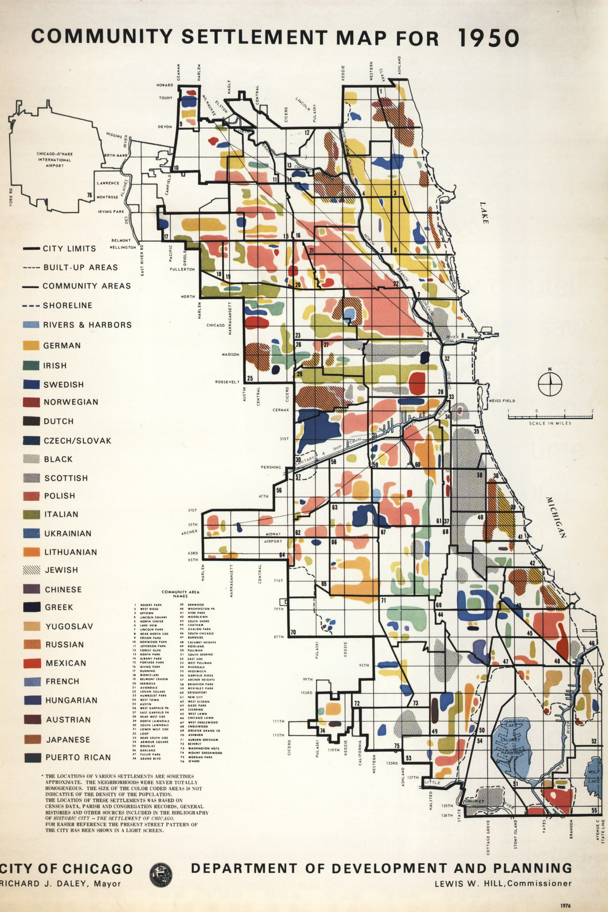

# chicago settlement maps, digitized!
this is a massive labor of love in order to digitize some of the most fascinating chicago maps out there (whcih is saying a lot, because there are a lot of fascinating maps) — the 1976 'community settlement area' maps created by the department of planning & development. 

here's the one from 1950:

it's pretty cool! and very complicated. and i love a challenge, and am a glutton for punishment, so to challenge my digitizing skills & to play around with some things, i decided to tackle digitizing the series of all six maps. (i found out there were six maps after finishing the 1950 one. finding out there were 5 more _did_ kind of make me break down a little and cry. but alas! here we are.)

# what i did for 1950
<!-- link to folder -->
the og. in order to create this, i started out with a few different processes, but after much deliberation and taking some things to heart, i opted for this workflow:

## import the map image into photoshop
do this to trim the fat. i did a few things here: first, i created a version that was just the city, no excess text, etc. it helped to have something with little distractions. 

then, i made a version that was just the city, no background. this leaves you with the skeleton street grid pattern + the blobs. 

from here, a little bit of ... eh. went into play. magic wand select (or color isolate) and remove the grid, then content aware fill to hopefully help tackle the blob sections that are obscured by the grid itself. if this doesn't work perfectly, which it probably won't, then take the no-background, blob-only layer, add a layer beneath, and color in the background so you have continuous blobs. 

_then_. another version, with filled in, continuous blobs, no background, in black and white. you should have a few different versions of the map — yes, they're all important. or at least sort of important. bear with me. 

## open up qgis, and pull the images in
you're going to use the qgis plugin **freehand raster georeferencer** for this, which is great and also a little wonky. pull them in, line it up, scale it appropriately, and then export the file using the plugin. 

from there, use the **magic wand** plugin with high precision and tolerance and apply it to the black and white layer. it should give you pretty alright matching against the different shapes. you're going to need to manually correct some, depending on how accurate you want it to be, and note that it really only works with solid colored shapes — any hashed or dotted shapes, or ones with patterns, will be a little off. i used the vertex editor tool to fix any discrepancies.

## focus on just getting the vector shapes first
get the vectors in and down, then color later! you're effectively tracing the features of the map over the scanned, georeferenced version, and i opted to do this in stages instead of nailing it all in one go; i wanted to fine-tune it instead of rushing. 

## add attributes
add the attributes necessary — my fields were `keymatch`, which was a slug for the legend + demographic group, `label`, which was the proper name of the group, and `jewish`, which indicated whether the feature was hashed as a jewish area or not. i'd recommend turning on a show you've watched before and going through and matching accordingly. this took a while. a lot of the colors are off. **encyclopedia of chicago** helped a lot. 

## export and visualize, and other fun stuff
so i made a custom webfont based on the text in the map (check out meigs-regular!) and then thought about pulling things into folium, before opting for a mapbox embed for interactive + focusing more on a pretty static map with SVG fills in QGIS. 

[back](./)
